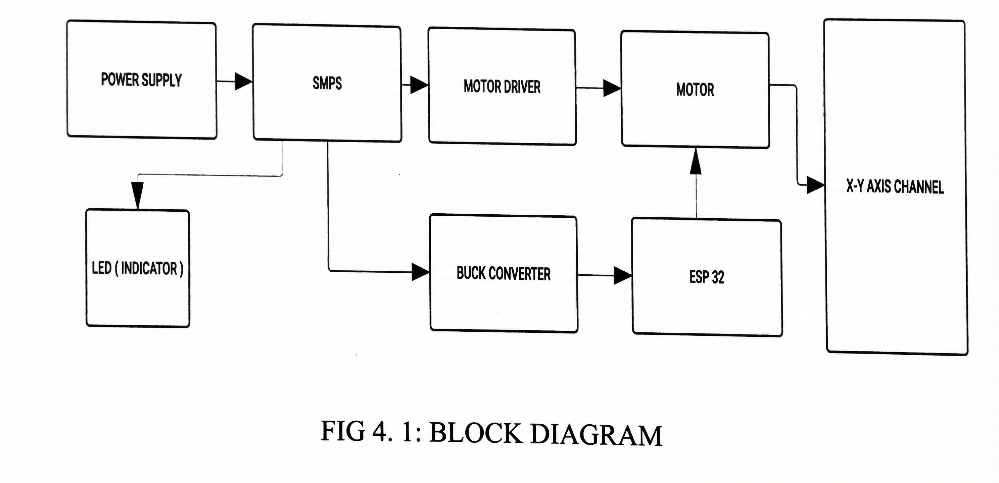

# AUTOMATIC RADIATOR CLEANING MACHINE

Electrical Engineering student at K.D.K. College of Engineering (KDKCE), Nagpur with expertise in PLC, SCADA, and AutoCAD Electrical. Technical Lead for the state-level finalist project ARCM (DIPEX-2026) and a Global Leadership Fellow at Aspire Institute. Passionate about industrial automation and data-driven engineering solutions.

# Automatic Radiator Cleaning Machine (ARCM) 🦾🚿

> **A State-Level Finalist Project (DIPEX-2026) focused on automated industrial maintenance.**

The Automatic Radiator Cleaning Machine (ARCM) is an automated system designed to efficiently clean industrial and automotive radiators. This project minimizes manual labor while significantly improving cleaning accuracy and consistency.

## 🚀 Key Features
* **Automated Logic:** Powered by ESP32-based intelligent automation.
* **Bluetooth Control:** Enables wireless operation for enhanced safety and convenience.
* **Dual Mode:** Supports manual override and fully automatic cleaning cycles.
* **Compact Design:** Portable and easily integrable with existing radiator systems.

## 🖼️ Project Visuals

### Block Diagram
Illustrates the system workflow and component interconnections:

### Circuit Diagram
Detailed connections of ESP32, L298N motor driver, and limit switches:

### Mechanical Design (CAD)
Structure and nozzle assembly of the machine:

  

## 🛠️ Tech Stack
* **Microcontroller:** ESP32 (Wi-Fi + Bluetooth enabled)
* **Programming:** C++ using Arduino IDE
* **Hardware:** DC Motors, Motor Drivers (L298N/L293D), Water Pumps, Power Supply
* **Skills Involved:** Embedded C, Circuit Design, Industrial Automation

## 🏆 Achievements
* **State-Level Finalist:** Successfully presented at DIPEX-2026, Chhatrapati Sambhaji Nagar
* Developed at K.D.K. College of Engineering (KDKCE), Nagpur

---

## 📄 Project Documentation & Research Report

For a comprehensive technical deep-dive into the project's design, methodology, and experimental results, please refer to the official project report:

* **Full Project Report (PDF):** [View ARCM Technical Report on Google Drive](https://drive.google.com/file/d/1VWif7OUyil0HML438K4r7u9id3fKzNUk/view?usp=drivesdk)

---

## ⚙️ Operational Methodology

The ARCM system follows a structured operational flow to ensure precise and safe cleaning:

1. **System Initialization:** The machine establishes a Bluetooth connection with the user's terminal (Device ID: `P_ARCM`).
2. **Command Processing:** Commands like 'S' (Start) and 'X' (Emergency Stop) are processed by the ESP32.
3. **Automated Cleaning Cycle:** The nozzle assembly moves across the radiator fins using high-torque DC motors.
4. **Smart Reversal Logic:** Limit switches at both ends detect the boundary limits, triggering an automatic direction reversal for continuous cleaning cycles.
5. **Real-time Monitoring:** An indicator LED and serial feedback provide constant status updates to the operator.
6. 
## 👨‍💻 Developed By
**Virendra Katre**  
*Electrical Engineering Student | Technical Lead*  
[LinkedIn Profile](https://www.linkedin.com/in/virendrakatre) | [Portfolio](https://virendrakatre.carrd.co/)
